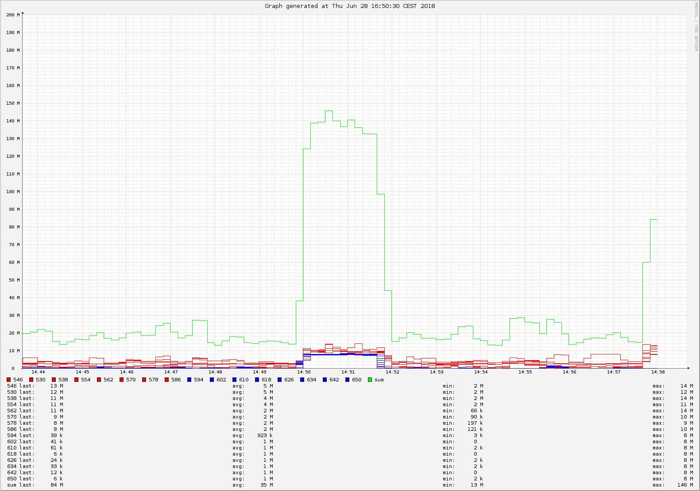
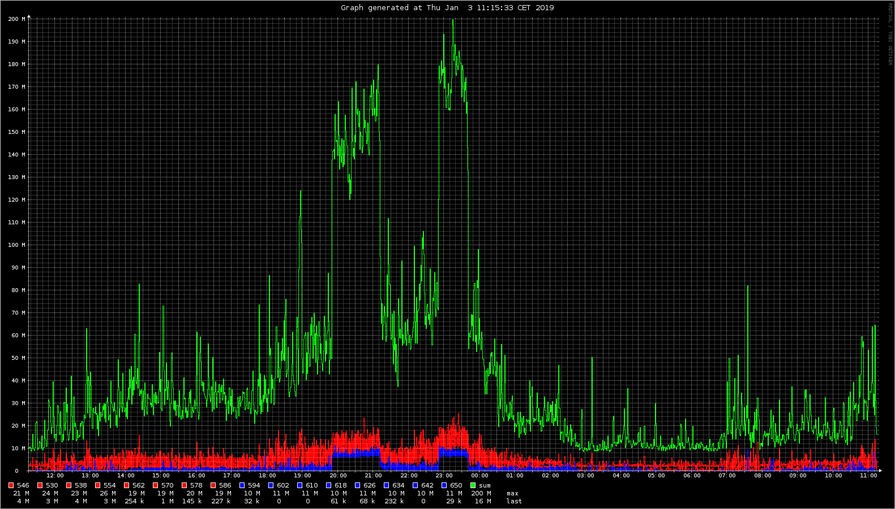
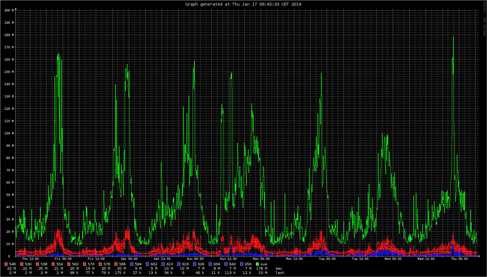
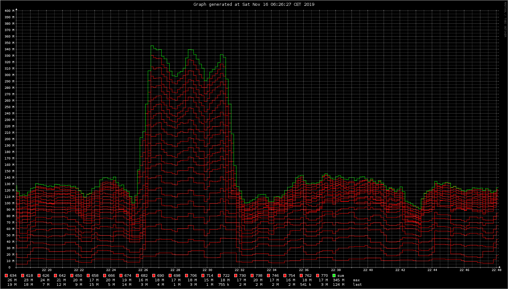

docsis-cable-load-monitor
=========================

what is it
----------

- a small tool to monitor downstream load on DOCSIS cable networks
- the ingenious idea how to realize this with cheap hardware originates from here: [Auslastung des eigenen Segments ansehen](https://www.kdgforum.de/viewtopic.php?f=69&t=15097)

required hardware
-----------------

- basically any linux machine with Linux DVB API (Version 3, Version 5.x) and DVB-C support is suitable
- to ease things further following components are recommended:
    - Raspberry Pi (e.g. Pi 3 Model B, earlier B models may also work)
    - TV stick: Sundtek MediaTV Pro III (DVB-C/T/T2, FM-Radio, AnalogTV)

software installation
---------------------

- first install Raspbian on your RPi: [Download Raspbian for Raspberry Pi](https://www.raspberrypi.org/downloads/raspbian/)
- after this the following additional packages are required:
        
        sudo apt install wget gawk lynx dvbsnoop dvbtune dvb-tools rrdtool feh

- Sundtek MediaTV Pro driver installation:

        wget http://www.sundtek.de/media/sundtek_installer_181220.135032.sh
        sudo sh sundtek_installer_181220.135032.sh -service -nolirc -noautostart

- finally install the load monitoring tool:

        wget https://raw.githubusercontent.com/sp4rkie/docsis-cable-load-monitor/master/CableLoadMonitor.awklib
        wget https://raw.githubusercontent.com/sp4rkie/docsis-cable-load-monitor/master/CableLoadMonitor

how to use it
-------------

- to execute the program with some reasonable defaults simply type

        sh CableLoadMonitor

this first will try to automatically retrieve the downstream channel frequencies in use.
Currently this will work only for an Technicolor TC4400 DOCSIS modem. If this is not available you must provide the
frequency list manually by means of the '-f' option (see below). 
The program then will start to meter the cable load. The raw results are shown on the console.

- alphanumeric support

An example console output for 16 downstream channel frequencies could look like this:

        reading downstream channel frequencies from cache
        downstream channel frequencies now in use: [ 16 ] 546 530 538 554 562 570 578 586 594 602 610 618 626 634 642 650
        point in time where the displayed graph ends: now
        time span covered by the displayed graph: 840s

        [...]
        14:42:20:   4967 11105  3123  7030  2538   264  1519   746     2   109     3    82   110     7   873   124  32602
        14:42:45:   5293  3108  2228  2422   649   183   207   298   130    66   274    24     8   141     3   135  15169
        14:43:09:   2779  2298  4882  4094   454   752  2262  1015    16     4    60    55   112    89   166     6  19044
        14:43:35:   2862  6100  2568  2956   253   799  2270  1414   102    32     4   171   902   140   150   119  20842
        14:43:58:   2680  3958  3629  3889  4096   684   224   916    54    60    63    57   137   138   224    52  20861
        14:44:20:   2281  2613  2711  3060   298   871   248   552    62    87    48   176   118   201    48   194  13568
        14:44:43:   2530  4366  2848  2538  1128  1718   324   271    61    64    52    69    69    68    68    78  16252
        14:45:06:   2458  2594  2568  5957   789   982   197  2593   517   169   167   830    48    68   295    41  20273
        14:45:27:   2349  2675  3058  2359   249  1141  3113   162     5     2   178     0     2     3     3     3  15302
        14:45:56:   3357  4917  4457  4228    66   953   367  1460    15    95   110   233   114    56    69    79  20576
        14:46:18:   3530  2727  4061  3941   446   804   852  1671    50   173    98    59    85    71    87    59  18714
        14:46:40:   3697  7030  4993  3417  1838  2124   440   892    90   234    55   160   627   222    57    82  25958
        14:47:02:   2482  2409  2544  3597  2773   866   384   983    55   132    93    74    10     3    17    27  16449
        14:47:24:   2503  2521  2663  5200  5919  1891  5693   672    28    68    57    23   120    58    66   185  27667
        14:47:46:   2416  4156  2259  2253   620   290   405   214    65    24     5    12    19     4     2     2  12746
        14:48:12:   2680  4928  5111  2422   593   448   461  1216     3     3   122   253     4   487   802    64  19597
        14:48:35:   2455  2373  2484  3077   408   445   909   542    63    69    58    56    53    53    60    52  13157
        14:48:58:   3858  2282  2664  2921   411    90   588  2519    68    54    54    42    60    66    53    53  15783
        14:49:20:   2419  2828  2595  3067  1637   271  1059   142    63    57    65    54    83    22   107    13  14482
        14:49:44:   2282  2358  2406  2382    89  2540  2781   505     0  4994  7925  7950  7713  7687  7428  7809  66849
        14:49:59:  11598 10881  9275 11430  9417  7712  8418  8041  7687  8460  8122  7447  7783  8053  7748  7520 139592
        14:50:10:   9621  9088  9753 10042  9245 10599  9860 10204  7593  7339  7844  7710  7863  7612  7854  7783 140010
        14:50:20:  10503  9495 10401  8847  8788  9903  8244  9548  7952  7539  7809  8272  7614  7920  7882  7780 138497
        14:50:31:  10011 11830 14935  8683 16282  7963  7848  7836  7983  8021  7758  7650  7465  7428  7706  7996 147395
        14:50:42:  11242  9518 10743  9981  7722  7783  7729  8040  7614  8021  7952  8214  7710  7952  7920  7520 135661
        14:50:52:  10787  9571  9548  9635  8638  8659  9487  9217  7813  8575  8098  8122  8396  8330  8360  8503 141739
        14:51:03:  11959  9275  9471  9046  8262  8530  7840  7829  7882  7829  7687  7520  7825  7911  7614  7882 134362
        14:51:13:  14395  9138  8770 10152  7783  8058  8053  7901  7520  7924  7882  7593  7339  7984  7593  7958 136043
        14:51:24:   9649 10057  8924  9716  7648  7670  7630  8961  8047  7339  8122  7710  7882  7576  7952  8041 132924
        14:51:34:   9471 11706  8904  9209  8743  9681  7934  1338    93    97    82    55    66    52    67    54  67552
        14:51:53:   3123  2403  2325  3765   871   850   627   760    54    67    63    56    60    95    54    53  15226
        14:52:15:   3696  6388  2454  2375   941  2936   373   354   124    97   457    54    53    52   123    56  20533
        14:52:36:   2311  2549  3390  5807   179   340   310  1382    89   105    56    57    76    82    45    76  16854
        14:52:57:   2839  3380  2295  2582  2139   391   649  1854    54    48     8    58     2     4     5    15  16323
        14:53:22:   3165  3885  3239  2505   806  4014  2204  3472     8   211    37    13     2     2     4    25  23592
        14:53:45:   4004  4415  2405  2711  1264   327   357   175    50    11    16    40   113   105     0    20  16013
        14:54:10:   2334  3164  2311  3349    73   411   944   121    40   106    22     2     7    25    40    34  12983
        14:54:35:   2958  3077  4057  5971  2851  2872  3399  2798     3    15     2    20    28    21     6    28  28106
        14:54:55:   4354  3942  4407  4327  1752  1934  2264  3001     8    21    75    44    15    16    32     9  26201
        14:55:18:   3234  2314  3719  3656   411  1461  1222   941   699  1163  1331  1410  1391  1212  1391   675  26230
        14:55:36:   7724  2853  2482  2490    76   373   983   511     9     0     3    12    33     6    57    23  17635
        14:56:01:   3421  2908  2267  2259   100   573   828  1873    89    16    14    14     9     9     7     6  14393
        14:56:26:   7939  2262  2315  2416   121    90  1098   463   102    32    75    77    25     5     9     4  17033
        [...]

The lines start with the time of measurement followed by 16 values representing the cable load (in kbit/s) for each down channel. The last value is the overall sum. 
Ideally we would take a snapshot of all 16 values at the same time. Since we can receive only one frequency at a given time we collect the values sequentially.
For 16 channels this typically takes about 25s what seems to be acceptable.

- graphic support

The program also generates some graphics by means of the 'rrdtool' package. You can visualize this issuing

        feh -d --reload 10 CableLoadMonitor.png

The alphanumeric example from above looks like this:

The metered values start moderately at about 20Mbit/s. At 14:50 a download with 120Mbit/s initiates spanning a period of about 2 minutes. The values peak in 140Mbit/s reflecting the sum of 20Mbit/s + 120Mbit/s.

Sample graph showing a newer theme (24h recording):

Sample graph showing a newer theme (7d recording):

Sample graph showing display mode 1 (30min recording):

- command line options

        Usage: CableLoadMonitor
          -h                    - print this help and exit
          -f [0-9]+(:[0-9]+)*   - specify downstream (DS) channel frequencies (in MHz)
          -f                    - force scan of TC4400 for DS channel frequencies
          -c [0-9]+             - create a RRD base with given RRA steps (in secs)
          -r [0-9]+             - recording history size (in secs)
          -w [0-9]+             - width of generated graph(s)
          -h [0-9]+             - height of generated graph(s)
          -g [0-9]+ [0-9]+      - generate a snapshot with stop at and length (in secs)
          -d [01]               - display mode (0 == standard, 1 == accumulated)
          -i                    - ignore errors reported by dvbtune

        Defaults:
          -c 10           # 10 secs
          -r 604800       # 1 week
          -w 1400      
          -h 1000      

        Example (continuously record new data):
        CableLoadMonitor -d 1 -r 3600 -f 626:634 -i
         - use display mode 1 (accumulated)
         - keep 3600 secs of data
         - scan 626 MHz and 634 MHz downstream channel frequencies
         - ignore bit errors reported by DVB driver
         - generate graphs of size 1400x1000 (default)

        Example (take a single snapshot of existing data):
        CableLoadMonitor -g 27500 1800 -w 1500 -h 800
         - extract a snapshot of 1800 secs length ending 27500 secs in the past
         - generate graph of size 1500x800

- diagnosis

The program logs all activity to file `CableLoadMonitor.log`. This will be the first place to look at if something went wrong.

reference
---------

[Auslastung des eigenen Segments ansehen](https://www.kdgforum.de/viewtopic.php?f=69&t=15097)

[Auslastung des eigenen Segments ansehen (reloaded)](https://www.unitymediaforum.de/viewtopic.php?f=53&t=37095)

[Installation unter Linux (allgemein)](https://support.sundtek.com/index.php?topic=2.0)

